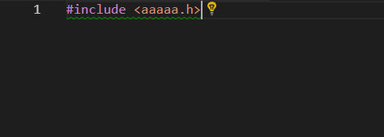

# Visual Studio Code でOpenGLプログラミング
## C/C++環境構築
### VScodeのC環境構築
拡張機能「`C/C++ for Visual Studio Code`」を導入する。その後、エディタを再起動する。拡張機能「`C++ Intellisense`」を導入する。その後、エディタを再起動する。VScodeのC/C++環境の導入が完了した。

### Cライブラリ情報の追加
導入したC/C++環境のセッティングを行う。cプログラムをvscode上で読み込み、標準ヘッダーファイルをインクルードを記述する。すると緑色の波線が表示される（されない場合は、一度ソースファイルを保存する）。画像では、意図的に存在しないヘッダーファイルをインクルードしているが、実際は標準ヘッダーファイルでも波線が表示される。



`#include`の`#`あたりをポインタにのせ、電球マークをクリック。`Edit Includ Path setting`を選択する。

すると、`.vscode/c_cpp_properties.json`が生成される。この`"includePath"`プロパティに、インクルードヘッダーファイルのパスを絶対パスで記述する。

Visual C++におけるヘッダーファイルのパスは、Visual Studioの開発者コマンド プロンプトにて

```
echo %INCLUDE%
```

を実行することで確認できる。出力されたパスは、`;`で区切られていて、改行されていないので注意。筆者の環境（Visual Studio 2015）では、

```
C:\Program Files (x86)\Microsoft Visual Studio\2017\Community\VC\Tools\MSVC\14.15.26726\ATLMFC\include;C:\Program Files (x86)\Microsoft Visual Studio\2017\Community\VC\Tools\MSVC\14.15.26726\include;C:\Program Files (x86)\Windows Kits\NETFXSDK\4.6.1\include\um;C:\Program Files (x86)\Windows Kits\10\include\10.0.17134.0\ucrt;C:\Program Files (x86)\Windows Kits\10\include\10.0.17134.0\shared;C:\Program Files (x86)\Windows Kits\10\include\10.0.17134.0\um;C:\Program Files (x86)\Windows Kits\10\include\10.0.17134.0\winrt;C:\Program Files (x86)\Windows Kits\10\include\10.0.17134.0\cppwinrt
```

となった。このヘッダーファイルへのパスを。`.vscode/c_cpp_properties.json`の`"includePath"`プロパティに追加する。


### clang導入
ソースファイルの体裁を自動的に整えるclangを導入する。まずMSYS2を導入する。
https://www.msys2.org/

インストールを進める。導入したMSYS2を起動し、Clangを導入する。

```
    pacman -S mingw-w64-x86_64-clang
```

Clangを導入したら、`C:\msys64`下にある`clang-format.exe`を探す、筆者の環境では`C:/msys64/usr/bin/clang-format.exe`にあったが、`C:/msys64/mingw64/bin/clang-format.exe`にある場合もある。

### clang_format_pathの設定
VScode上でClangを利用する`C++ IntelliSense`の設定を行う。Ctrl + ｀で設定画面を開き、右上から「setting.jsonを開く」を選択。ユーザー設定に、`clang_format_path`のプロパティを追加。プロパティは`clang-format.exe`への絶対パスを記述する。筆者の環境では

```
    "C_Cpp.clang_format_path": "C:/msys64/usr/bin/clang-format.exe"
```

となった。これで体裁を自動的に整える機能が追加できた。


### 設定後も体裁を自動的に整わない場合
Vscode上の設定で、体裁設定ができていないかもしれない。setting.jsonのユーザー設定に以下を追加する。

```
    "editor.formatOnType": true,  // 入力した行の体裁を整えるか
    "editor.formatOnPaste": true,   // 貼り付けた文字列の体裁を整えるか
    "editor.formatOnSave": false,   // 保存時に体裁を整えるか
```